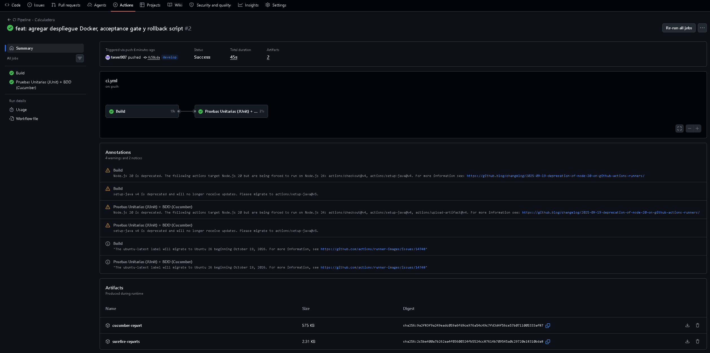
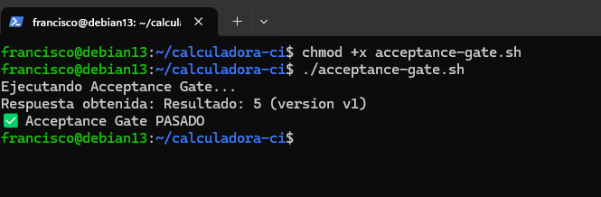
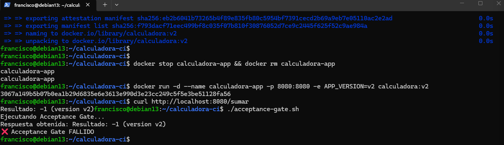
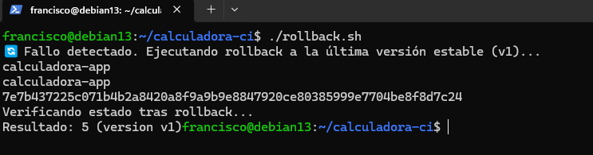

# Calculadora CI — Examen Final Automatización de Pruebas

## Descripción del proyecto
Proyecto Maven que implementa una calculadora simple expuesta como servicio HTTP,
con pruebas unitarias (JUnit 5) y pruebas BDD (Cucumber), integrado en un pipeline
de CI/CD con GitHub Actions y una estrategia de despliegue con rollback simple.

## Estrategia de ramas
Se utilizó **GitFlow**: `main` (producción), `develop` (integración). Los cambios
se desarrollan e integran en `develop` antes de promoverse a `main`.

## Cómo ejecutar las pruebas
```bash
mvn clean test
```
Esto ejecuta en una sola corrida las pruebas unitarias (JUnit) y las pruebas BDD
(Cucumber), gracias a la integración vía JUnit Platform.

## Pipeline de CI/CD
Definido en `.github/workflows/ci.yml`. Se dispara automáticamente en cada
`push` o `pull request` a `main`, `develop` o ramas `feature/*`. Contiene dos jobs:
1. **Build**: compila el proyecto con JDK 21.
2. **Test**: ejecuta `mvn clean test` (unitarias + BDD) y publica como artifacts
   los reportes de Surefire y el reporte HTML de Cucumber.

Resultados visibles en la pestaña **Actions** del repositorio en GitHub.

## Estrategia de despliegue y rollback
Se implementó un **rollback simple** sobre contenedores Docker:
- La app se empaqueta como JAR ejecutable (`maven-jar-plugin`) y se containeriza
  (`Dockerfile`), exponiendo un endpoint `/sumar` y `/health` en el puerto 8080.
- **acceptance-gate.sh**: valida que el resultado esperado (`Resultado: 5`) se
  obtenga desde el contenedor desplegado. Actúa como barrera de aceptación antes
  de considerar el despliegue exitoso.
- **rollback.sh**: detiene el contenedor con la versión defectuosa y vuelve a
  desplegar la última imagen estable (`calculadora:v1`).

### Flujo demostrado
1. Se despliega `calculadora:v1` → Acceptance Gate **pasa** (`Resultado: 5`).
2. Se simula un bug en `calculadora:v2` (operación cambiada a resta) → Acceptance
   Gate **falla** (`Resultado: -1`).
3. Se ejecuta `rollback.sh` → el sistema vuelve a `v1` → Acceptance Gate **pasa**
   nuevamente.

## Evidencias
- Captura 1: Pipeline de CI en GitHub Actions (build + test en verde).

- Captura 2: Despliegue v1 exitoso, Acceptance Gate PASADO.

- Captura 3: Despliegue v2 fallido, Acceptance Gate FALLIDO.

- Captura 4: Ejecución de rollback.sh, retorno a v1, Acceptance Gate PASADO.

## Autor
Francisco Garrido